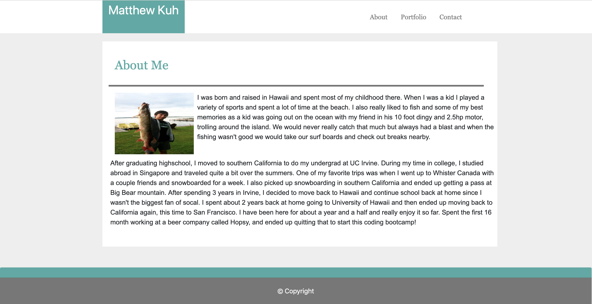
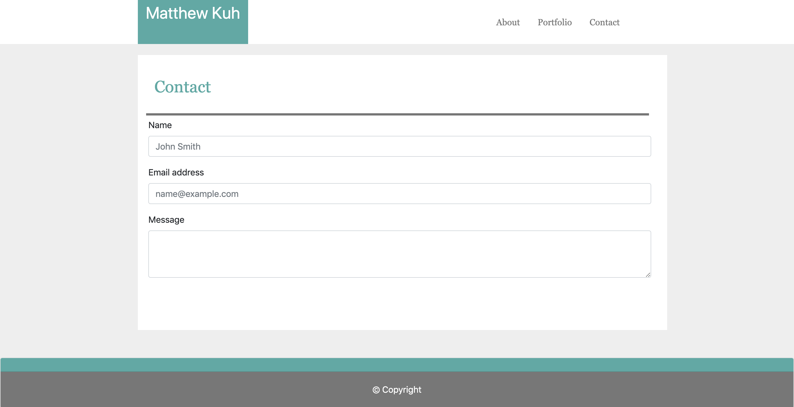
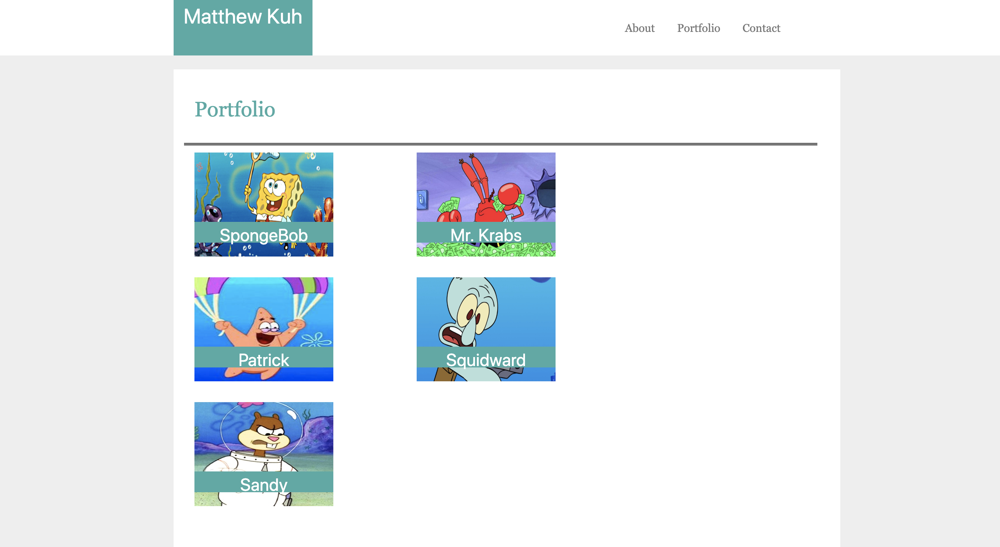

### I used html, css, and bootstrap to remake my profile page using various components from the bootstrap website

## Tech I Used

1. [BootStrap](https://getbootstrap.com/docs/4.3/getting-started/introduction/) 
2. [HTML](https://www.w3schools.com/html/html_intro.asp)
3. [CSS](https://www.w3schools.com/html/html_css.asp)

Author : [Matthew Kuh](https://github.com/matkuh)

